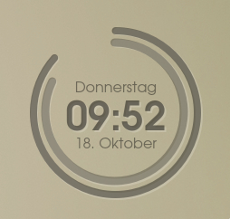

# Simple Arc Clock

Simple desktop clock that is easy to configure. Left mouse drags the clock around the desktop, right mouse opens menu. Depending on your window manager alt+right mouse resizes.

### Installation
```
sudo ./install.sh
```
A menu entry should appear under Utilities.
